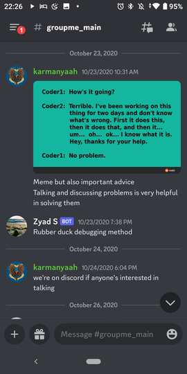
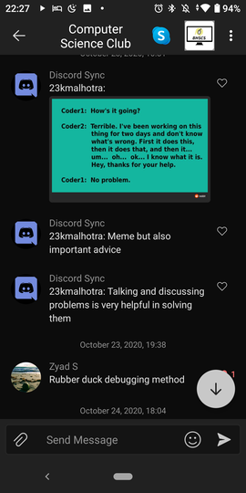

# groupme_discord_bridge_v3

This project is completed and has been running in production syncing my school's CS and Math club chats uninterrupted since 2020. This is arguably the most useful and set-it-and-forget-it software I have ever made (as of 2022). I continue to run this, however, it won't be updated as I rarely use GroupMe anymore.

This is what the chats look like (notice the Bot designation on users from the other side):
 

---

This project syncs chats between Discord and GroupMe.
I originally wrote this to learn Go and reduce resource usage of the Python bridge I previously used. It uses <20MB RAM in production syncing 3 low traffic chats.

 To install, copy config.toml.example into config.toml in the current working directory of the binary running.  
 This will sync messages and images from one or more discord channels (on the same server or not) into one groupme chat.  
 Creating a discord bot and inviting it to the server, and creating a groupme bot in the chat is required.
 
 Use a discord bot URL like: 
 `https://discord.com/api/oauth2/authorize?client_id=<yourid>&permissions=537250816&scope=bot`

Running the python script could help with groupme setup though <dev.groupme.com> can do the same.
